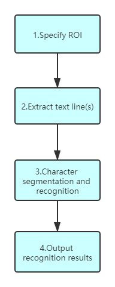

# Principles of Dynamsoft Label Recognition Algorithm

Dynamsoft Label Recognition (DLR) is a flexible SDK used to implement zonal OCR functionality in cross-platform applications. 

DLR powers your software development from the following aspects: 
(1) performance of zonal text recognizing, 
(2) integration of multipurpose image processing, 
(3) extensibility of deployment. 

In this article, we will present the architectures and their corresponding contributions to the above advantages.

## Flexible Algorithm Flow & Versatile Parameters

The algorithm of DLR includes a flow of 4 stages at the top level, as illustrated in Figure 1, where extract, segmentation and recognition are the two core stages. DLR is designed to deal with a variety of zonal text recognition scenarios and offers many customizable parameters to increase its versatility. Furthermore, the architecture of the algorithm and its parameters solidifies the agility to meet new requirements. 

   

   
Figure 1 – Top Level Flow of DLR Algorithm

 

### Stage 1. Specify regions of interest (ROI). 

This stage begins with how to specify a ROI for a variety of sources, including image files, videos, or buffers of other applications. A ROI in DLR consists two parts: reference region and text area. A reference region could be specified by three ways now:
- set by absolute or relative coordinates directly
- set by barcode region which detected by DBR
- set by predetect region according background colour, foreground colour etc. 

A text area is specified by percentage coordinates relative to the reference region. Their relationship is shown in the figure below.

   

   
Figure 2 – ROI definition

 

Table 1 lists these parameters and their respective design intents.

Table 1 – Parameters of DLR Algorithm in the Stage 1

| **Parameter Name** | **Functionality** | **Status** |
| ------------------ | ---------------------------- | ---------- |
| [`ReferenceRegionNameArray`]({{ site.parameters-reference }}label-recognition-parameter/parameter-control.html#ReferenceRegionNameArray) | The name array of the ReferenceRegion object(s). | Available |
| [`RegionPredetectionModes`]({{ site.parameters-reference }}label-recognition-parameter/RegionPredetectionModes.html#regionpredetectionmodes) | To limit the subsequent stages in special areas to speed up by detecting the regions of interest automatically. Pre-detection is based on the colour/grayscale distribution of each area. | Available, Extensible |
| [`ReferenceRegion`]({{ site.parameters-reference }}reference-region/parameter-control.html) | To specify a reference region for text area(s). | Available |
| [`TextArea`]({{ site.parameters-reference }}text-area/parameter-control.html) | To specify a target area for text recognition. | Available |
| [`Pages`]({{ site.parameters-reference }}label-recognition-parameter/parameter-control.html#Pages) | To specify pages or the range of pages of a file (.tiff or .pdf) for label recognition. | Available |
| [`GrayscaleTransformationModes`]({{ site.parameters-reference }}label-recognition-parameter/parameter-control.html#GrayscaleTransformationModes) | To emphasize the features of regions of interest with processing of the grayscale image.  | Available |

### Stage 2. Extract text line(s). 

 Before extracting text line(s), some optional steps can be taken to speed up, such as preprocessing candidate text region, binarization, setting hints about text line count, letter height, text line length etc. These steps are related to the respective parameters listed in the Table 2.

Table 2 – Parameters of DLR Algorithm in the Stage 2

| **Parameter Name** | **Intent and Functionalities** | **Status** |
|--------------------|--------------------------------|------------|
| [`ImagePreprocessingModes`]({{ site.parameters-reference }}label-recognition-parameter/ImagePreprocessingModes.html#imagepreprocessingmodes) | To enhance/keep features of text zones by processing colour or grayscale images. | Available, Extensible |
| [`BinarizationModes`]({{ site.parameters-reference }}label-recognition-parameter/BinarizationModes.html#binarizationmodes) | To enhance/keep features of text zones by applying different binarization methods and arguments. | Available, Extensible |
| [`LetterHeightRange`]({{ site.parameters-reference }}label-recognition-parameter/parameter-control.html#LetterHeightRange) | . | Available |
| [`LineStringLengthRange`]({{ site.parameters-reference }}label-recognition-parameter/parameter-control.html#LineStringLengthRange) | . | Available |
| [`MaxLineCharacterSpacing`]({{ site.parameters-reference }}label-recognition-parameter/parameter-control.html#MaxLineCharacterSpacing) | . | Available |
| [`LinesCount`]({{ site.parameters-reference }}label-recognition-parameter/parameter-control.html#LinesCount) | . | Available |

### Stage 3. Character segmentation and recognition.

This is the most complicated stage. In order to get more accurate results, multiple iterations are used to segement and recognize characters from each text line. There are a few methods to deal with varying text quality situations. Table 4 lists the parameters to customize the key step.

Table 3 – Parameters of DLR Algorithm in the Stage 3

| **Parameter Name** | **Intent and Functionalities** | **Status** |
|--------------------|--------------------------------|------------|
| [`CharacterModelName`]({{ site.parameters-reference }}label-recognition-parameter/parameter-control.html#CharacterModelName) | . | Available |
| [`TextRegExPattern`]({{ site.parameters-reference }}label-recognition-parameter/parameter-control.html#TextRegExPattern) | . | Available |
| [`LineStringRegExPattern`]({{ site.parameters-reference }}label-recognition-parameter/parameter-control.html#LineStringRegExPattern) | . | Available |

### Stage 4. Output the recognition results. 

This stage organizes the text recognition results. DLR would check all results and filter them according to the following parameters.

Table 4 – Parameters to Organize the Results

| **Parameter Name** | **Intent and Functionalities** | **Status** |
|--------------------|--------------------------------|------------|
| [`LinesCount`]({{ site.parameters-reference }}label-recognition-parameter/parameter-control.html#LinesCount) | To filter text results with given lines count. | Available |
| [`LineStringLengthRange`]({{ site.parameters-reference }}label-recognition-parameter/parameter-control.html#LineStringLengthRange) | To filter text results with length limitations of text line. | Available |
| [`TextStringLengthRange`]({{ site.parameters-reference }}label-recognition-parameter/parameter-control.html#TextStringLengthRange)  | To filter text results with length limitations of text area. | Available |
