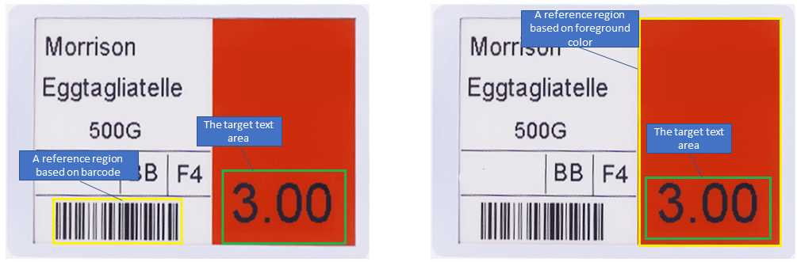
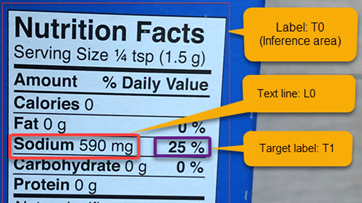

# Overview of Dynamsoft Label Recognizer

Dynamsoft Label Recognizer (DLR) is an SDK designed to recognize meaningful zonal text or symbols in an image (Label). Common scenarios include price tags in supermarkets, inventory labels in warehouses, VIN codes on car windshields, driver licenses, ID cards, etc. 

DLR powers your software development from the following aspects:
- Introduces the `Reference Region` feature to reduce the difficulty of specifying a Region of Interest (ROI).
- Creates the `Inference Area` concept to effectively calculate the target label position by utilizing fixed relative position characteristics between text blocks, particularly for key-value pairs.
- Innovates a text recognition engine that combines the advantages of Convolutional Neural Network (CNN) models and traditional image feature extraction.
- Supports extensible regular expressions to improve the accuracy of text recognition.
- Utilizes a variety of processing modes at different algorithm stages to maintain great scalability.

With DLR, you can create customizable text detection and recognition software with enterprise-grade performance to meet your business needs.

## Key Features

### Reference Region 
The `Reference Region` is an important feature of DLR. It can greatly enhance the ability to localize ROI. Generally, a label is not fixed in a certain position, but we could utilize some characteristic areas around the target label to locate it. The reference region may utilize the features such as foreground and background colours, straight lines, textures, or barcodes around the label.

A reference region could be:
- A predefined region with absolute or relative coordinates known in advance.
- A barcode region.
- A pre-detect region according to the background colour, foreground colour, etc. 

The position of a label (also called text area) is specified by percentage coordinates relative to the reference region. The relationship between the reference region and the label is shown in the figure below.

   

   
Figure 1 – ROI definition

 

On the left side of the above figure, the position of the reference region could be determined by the barcode. The barcode can be localized and recognized through [Dynamsoft Barcode Reader](https://www.dynamsoft.com/barcode-reader/overview/?urlsource=navigation). In addition, if there are multiple barcodes in an image, we can further determine the target barcode region by specifying the barcode formats and barcode text. 

On the right side, the background colour of the reference region is specified as red, then DLR can automatically detect it through algorithms.

### Inference Area

The `Inference Area` feature in DLR is based on the relative position characteristics between text blocks in an image. It will be introduced in version 2.0 to help you quickly and effectively calculate the target label position.

As shown in the figure below, the text blocks L0 and Label T1 inside the label T0 forms a key-value pair. 

   

   
Figure 2 – text-based region inference

 

T0 is not only a label but also an inference area with appropriate inference parameters. DLR can find the text line L0 with the same vertical coordinate as T0, then calculate more accurate reference coordinates of the target label T1.

### Text recognition engine
In order to obtain the most accurate and robust text recognition results, DLR has innovated a `text recognition engine`. It combines the advantages of CNN(Convolutional Neural Networks) models and traditional image feature extraction.

The text recognition engine of DLR supports one primary model and multiple auxiliary models. In the iterative recognition process, DLR will automatically select the smallest CNN-model according to the character sets. For example, if the text of a label contains both numbers and letters, but only numbers in a certain position. If it is known by DLR and there is a number-only auxiliary model in the directories, DLR will automatically select the number-only model for best results. Additionally, DLR also supports data set training in order to generate customized recognition models. In some cases, there may still be some misreading of certain characters. Then the traditional image features of each character will be captured to further distinguish.

### Extensible Regular Expressions
In order to improve the accuracy of text recognition, DLR supports `extensible regular expressions` to correct the misrecognized characters. Using the matching results, DLR will perform segment analysis to find out the exact position that does not match the regular expression. Then DLR attempts to reduce the size of the candidate recognition character set as much as possible via the partial matching results. Finally, DLR will perform multiple iterations to correct the misrecognized characters through a variety of methods such as auxiliary models or character features. 

### Various processing modes
In order to cope with various scenarios, DLR provides a variety of processing modes at each stage of the algorithm to maintain great scalability. For example, the `BinarizationModes` provides several image binarization methods; The `RegionPredetectionModes` provides different pre-detection methods for the reference region. These modes can be configured not only through API but also through a configuration template. Furthermore, the implementation of these modes can be customized according to customer scenarios to seamlessly integrated with customer's project.

## [Usage scenarios]({{ site.docFullPath }}/use-cases)

### VIN Scanning
Vehicle Identification Numbers (VINs) are commonly used in the automotive industry for vehicles identification. With the help of DLR, users can identify any vehicle anywhere, anytime by scanning VINs.

### Retail
In retail, DLR ensures accurate price label recognition. Multiple price labels can be recognized accurately and quickly. Even when a barcode is damaged, the employees can make use of the label recognition feature to perform price verification.

### Inventory and Warehouse Management
Staff in a warehouse could utilize DLR for inventory management. Even if the barcodes are damaged, inventories can be easily recognized with the help of the accompanying text to make sure everything is in its place.

### ID Cards in Air Travel
Smart devices equipped with DLR-based OCR software help employees in the aviation industry scan machine-readable ID cards and passports easily. Passengers can scan their passports while checking-in online, thereby eliminating errors when entering the data and responding to alerts such as passport expiration.

### Lot No. on Drug Bottles in Healthcare
Based on DLR, we can integrate data capture and text recognition technologies into healthcare software, adding remarkable value to their applications. As an example, for pharmaceutical products that do not have data encoded within a barcode, DLR-based OCR software helps by instantly scanning ref or lot numbers. DLR also can be used for staff identification by scanning ID badge(name, number, etc.) on employees' chest.

### Parts Tracking and Maintenance
OCR software integrated with DLR helps maintenance operators easily track and find various parts in a warehouse. Smart device scanning solutions equipped with OCR software can easily replace dedicated scanning hardware that contributes to reducing the total cost of ownership. Employees can scan text and barcodes on different parts, saving time in the process and decreasing the chances of errors in tracking a large number of parts. 

### Parcel Labels in Transport and Logistics
OCR technology helps in reducing the errors and time consumption associated with manual data entry processes in the transport and logistics industries. With DLR, it becomes easier to read optical marks, text, and laser print, which can then index data in the document and dispatch system. When a barcode on a parcel or package is damaged, DLR can help you by reading the accompanying text instead. Advanced OCR software can scan multiple lines of text in one single scan.

### Voucher Code Scanning
With the help of DLR, companies can enable their customers to scan voucher codes on the back of gift cards using their mobile devices. To achieve this, companies need to integrate a serial number scanner into their app. This will be a good way to promote engagement with the company.

### Checks in Banking
Accurate data capture helps to simplify banking processes, making them more efficient. Recent OCR innovations allow customers to easily scan and deposit cheques via their mobile devices. The customer's signature, account number, and total amount will be checked. The amounts on cheques are printed with a special font which can be easily recognized by smart devices equipped with DLR-based OCR software. 

## Cross-Platform Programming Languages

DLR is cross-platform. The core of DLR is written in C/C++ for performance. The library is wrapped for .NET, Java, and other programming languages so that users can use DLR on iOS, Android, Windows, and Linux. Below is a list of supported OSes and programming languages: 

| OS            | Programming Language |
|---------------|----------------------|
|Windows        | C/C++/C\#/VB.NET/Java |
|Linux          | C/C++/Java            |
|Android        | Java                 |
|iOS            | Swift/Objective-C    |

