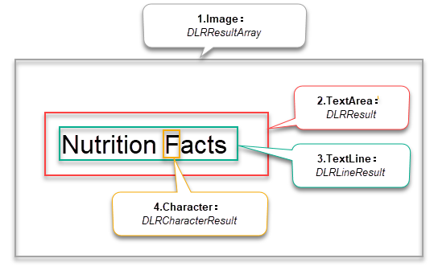

# User Guide - C

## Requirements
   
- Windows 
    - Windows 7, 8, 10, 2003, 2008, 2008 R2, 2012.
    - Visual Studio 2008 or above

- Linux
    - Linux x64: Ubuntu 14.04.4+ LTS, Debian 8+, etc
    - GCC 4.2+  

## Installation

If you don’t have SDK yet, please download the Dynamsoft Label Recognizer(DLR) SDK from the <a href="https://www.dynamsoft.com/label-recognition/downloads/?utm_source=docs" target="_blank">Dynamsoft website</a> and unzip the package. After decompression, the root directory of the DLR installation package is `DynamsoftLabelRecognizer`, which is represented by `[INSTALLATION FOLDER]`.

## Build your first application

Let’s start by creating a console application which demonstrates how to use the minimum code to recognize text from an image file.

<!-- >You can download the entire source code and compiled program from [Here]. -->

### Create a new project 

#### For Windows

1. Open Visual Studio. Go to File > New > Project, select Empty App and enter `DLRCSample` in the `name` text box.

2. Add a new source file named `DLRCSample.c` into the project.

#### For Linux
1. Create a new source file named `DLRCSample.c` and place it into the folder `[INSTALLATION FOLDER]\Samples\DLRCSample`.

2. Create a file named `Makefile` and put it in the same directory as the file `DLRCSample.c`. The content of `Makefile` is as follows:

    ```makefile
    CC=gcc
    CCFLAGS=-c

    DLRLIB_PATH=../../Lib/Linux

    LDFLAGS=-L $(DLRLIB_PATH) -Wl,-rpath=$(DLRLIB_PATH) -Wl,-rpath=./
    DLRLIB=-lDynamsoftLabelRecognizer

    TARGET=DLRCSample
    OBJECT=DLRCSample.o
    SOURCE=DLRCSample.c

    # build rule for target.
    $(TARGET): $(OBJECT)
        $(CC) -o $(TARGET) $(OBJECT) $(DLRLIB) $(LDFLAGS)

    # target to build an object file
    $(OBJECT): $(SOURCE)
        $(CC) $(CCFLAGS) $(SOURCE)

    # the clean target
    .PHONY : clean
    clean: 
        rm -f $(OBJECT) $(TARGET)
    ```

    >Note: The DLRLIB_PATH variable should be set to the correct directory where the DLR library files are located. The files and character models directory can be found in `[INSTALLATION FOLDER]/Lib/Linux`.

### Include the library

1. Add headers and libs in `DLRCSample.c`.   
   
    ```c
    #include <stdio.h>
    #include "<relative path>/Include/DynamsoftLabelRecognizer.h"

    // The following code only applies to Windows.
    #if defined(_WIN64) || defined(_WIN32)
        #ifdef _WIN64
            #pragma comment(lib, "<relative path>/Lib/Windows/x64/DynamsoftLabelRecognizerx64.lib")
        #else
            #pragma comment(lib, "<relative path>/Lib/Windows/x86/DynamsoftLabelRecognizerx86.lib")
        #endif
    #endif
    ```
   
    >Please replace `<relative path>` in the above code with the relative path to the `DLRCSample.c` file. The `DynamsoftLabelRecognizer.h` file can be found in `[INSTALLATION FOLDER]/Include/` folder. The import lib files (only for Windows) can be found in `[INSTALLATION FOLDER]/Lib/`. 
    
### Initialize the Dynamsoft Label Recognizer

1. Initialize the license key

    ```c
    char error[512];
    
    // 1.Initialize license.
    DLR_InitLicense("DLS2eyJvcmdhbml6YXRpb25JRCI6IjIwMDAwMSIsInByb2R1Y3RzIjoyfQ==", error, 512);
    ```  

    >Note:
    >- Network connection is required for the license to work.
    >- "DLS2***" is a default 7-day trial license used in the sample.
    >- If the license has expired, please request a trial license through the <a href="https://www.dynamsoft.com/customer/license/trialLicense?utm_source=docs" target="_blank">customer portal</a>.

2. Create an instance of Dynamsoft Label Recognizer

    ```c
    // 2.Create an instance of Label Recognizer.
    void* dlr = DLR_CreateInstance();
    ```

### Recognizing and output results

1. Recognizing text in an image 
    
    ```c
    // 3.Recognize text from an image file.
    errorcode = DLR_RecognizeByFile(dlr, "../../SampleImages/dlr-sample-vin.png", "");
    
    if(errorcode != DM_OK)
        printf("%s\n", DLR_GetErrorString(errorcode));
    ```

    >You can download the image [dlr-sample-vin.png](../assets/dlr-sample-vin.png) for testing. In addition, you can replace it with the full path of the image you want to recognize.

    >For the error handling mechanism, the SDK returns Error Code for each function and provides a function `DLR_GetErrorString` to get the readable message. You should add codes for error handling based on your needs. Check out [Error Code]({{site.enumerations}}error-code.html) for full supported error codes.

2. Get and output the recognition results

    ```c
    DLR_ResultArray *pDLRResults = NULL;
    DLR_Result* result = NULL;
    DLR_LineResult *lineResult = NULL;
    int lCount, rCount, li, ri;

    // 4. Get all recognized results.
    DLR_GetAllResults(dlr, &pDLRResults);

    if (pDLRResults != NULL && pDLRResults->resultsCount > 0)
    {
        rCount = pDLRResults->resultsCount;
        for (ri = 0; ri < rCount; ++ri)
        {
            printf("Result %d:\n", ri);

            // Get result of each text area (also called label).
            result = pDLRResults->results[ri];
            lCount = result->lineResultsCount;
            for (li = 0; li < lCount; ++li)
            {
                // Get the result of each text line in the label.
                lineResult = result->lineResults[li];
                printf("Line result %d: %s\n", li, lineResult->text);
            }
        }
    }
    else
    {
        printf("No data detected.\n");
    }
    ```

    The recognition results of SDK are organized into a four-tier structure: 
    - `DLR_ResultArray` corresponds to the results of an `image`
    - `DLR_Result` corresponds to the result of a `TextArea` (also called Label) 
    - `DLR_LineResult` corresponds to the result of each `TextLine` in the Label
    - `DLR_CharacterResult` corresponds to the result of each `Character` in the `TextLine`

    The structure is shown in the figure below:

    <div align="center">
    
    <p>Figure 1 – DLR Result Structure</p>
    </div> 

### Release allocated memory

1. Release the allocated memory for the recognition results and instance

    ```c
    if(pDLRResults != NULL)           
        DLR_FreeResults(&pDLRResults);
    
    DLR_DestroyInstance(dlr);
    ```

<!-- You can download the entire source code from [here]. -->

### Build and run the project

#### For windows

1. Build the application through Visual Studio and copy the related DLL files and character models directory to the same folder as the EXE file. The DLL files and character models directory can be found in `[INSTALLATION FOLDER]\Lib\Windows\[platforms]`.
    >Note: Select the corresponding folder (x86 or x64) based on your project's platform setting.

2. Run the program `DLRCSample.exe`.

#### For Linux

1. Open a terminal and change to the target directory where `Makefile` located in. Build the sample:

    ```
    >make
    ```

2. Run the program `DLRCSample`.
    ```
    >./DLRCSample
    ```

