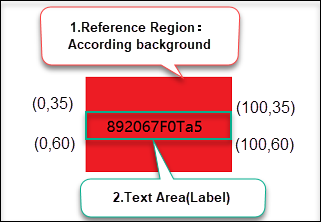

# Dynamsoft Label Recognizer - Advanced feature for C++

## Specify ROI

The `Reference Region` is an important feature of DLR. It can greatly enhance the ability to localize ROI. If you do not understand the concept of reference region in DLR, please refer to [here](../../introduction/index.md##reference-region) for a brief understanding. 

The ordinate origin of `text area`(also called label) is the top-left corner of the `reference region`. The x coordinate is a percentage value relative to the width of the `reference region` and the y coordinate is relative to the height.

### Manually specify the label position
If the target `text area` has a fixed position in images, you can specify the label position directly. For example, if the label is located in the upper left corner of the picture, and the width and height are both 50% of the picture, you can set it with the following code:

```cpp 
char error[512];

CLabelRecognizer dlr;

// step 1. get current runtime settings
DLRRuntimeSettings settings;
dlr.GetRuntimeSettings(&settings);

// step 2. set the text area(label) position by the percentage coordinates relative to the reference region. The default reference region is the entire image.
settings.textArea.points[0].x = 0;
settings.textArea.points[0].y = 0;
settings.textArea.points[1].x = 50;
settings.textArea.points[1].y = 0;
settings.textArea.points[2].x = 50;
settings.textArea.points[2].y = 50;
settings.textArea.points[3].x = 0;
settings.textArea.points[3].y = 50;

// step3. Apply the runtime settings to the `dlr` instance
dlr.UpdateRuntimeSettings(&settings, error, 512);
```

### Specify reference region by barcode

In some cases, the target `text area` may be near a barcode, as shown in figure 1:

<div align="center">

<p>Figure 1 –DLR Barcode Reference Region</p>
</div> 

The barcode can be localized and recognized through [Dynamsoft Barcode Reader](https://www.dynamsoft.com/barcode-reader/overview/?urlsource=docs). The following code demostrates how to specify a barcode reference region and a target text area:

```cpp 
// step 1. Create instance of Dynamsoft Barcode Reader and initialize the license.
CBarcodeReader dbr;
dbr.InitLicense(dbr, "<insert DBR license key here>");

// step 2. Decode the file and get the barcode results.
TextResultArray *pBarcodes = NULL;
dbr.DecodeFile("a.png","");
dbr.GetAllTextResults(&pBarcodes);

char error[512];

// step3. get current runtime settings
CLabelRecognizer dlr;
DLRRuntimeSettings settings;
dlr.GetRuntimeSettings(&settings);

// step4. Locate the reference region by Barcodes
settings.referenceRegion.localizationSourceType = DLR_LST_BARCODE;

// step5. Update the reference region by barcode results.
dlr.UpdateReferenceRegionFromBarcodeResults(pBarcodes, "");

// step6. Update the target label position relative to the barcode region.
settings.textArea.points[0].x = 0;
settings.textArea.points[0].y = 100;
settings.textArea.points[1].x = 100;
settings.textArea.points[1].y = 100;
settings.textArea.points[2].x = 100;
settings.textArea.points[2].y = 130;
settings.textArea.points[3].x = 0;
settings.textArea.points[3].y = 130;

// step7. Apply the runtime settings to the `dlr` instance
dlr.UpdateRuntimeSettings(&settings, error, 512);
```

>Please replace `<insert DBR license key here>` with your DBR license key. If you do not have a valid license, please request a trial license through the [customer portal](https://www.dynamsoft.com/customer/license/trialLicense?utm_source=docs). 

### Specify reference region by pre-detection
Sometimes, a reference region has a clear background color feature, as shown in figure 2:

<div align="center">

<p>Figure 2 – Reference Region by predetection</p>
</div> 

The following code demostrates how to specify a reference region and a target text area by pre-detection using the background colour feature:

```cpp
char error[512];

// step1. get current runtime settings
CLabelRecognizer dlr;
DLRRuntimeSettings settings;
dlr.GetRuntimeSettings(&settings);

// step2. locate the reference region by pre-detection
settings.referenceRegion.localizationSourceType = DLR_LST_PREDETECTED_REGION;

// step3. detects region using the general algorithm based on HSV colour contrast
settings.regionPredetectionModes[0] = DLR_RPM_GENERAL_HSV_CONTRAST;

// step4. Set the argument value of `ForeAndBackgroundColours` like " [ForegroundColour, BackgroundColour, Tolerance]". 

dlr.SetModeArgument("RegionPredetectionModes", 0, "ForeAndBackgroundColours", "[-1,0,10]", error, 512);

// step5. Update the target label position relative to the pre-detected region.
settings.textArea.points[0].x = 0;
settings.textArea.points[0].y = 35;
settings.textArea.points[1].x = 100;
settings.textArea.points[1].y = 35;
settings.textArea.points[2].x = 100;
settings.textArea.points[2].y = 65;
settings.textArea.points[3].x = 0;
settings.textArea.points[3].y = 65;

// step6. Apply the runtime settings to the `dlr` instance
dlr.UpdateRuntimeSettings(&settings, error, 512);
```

>In step 4, The `ForegroundColour` and `BackgroundColour` are the Hue values in the HSV colour space for defining the regions you want to predetect. The value -1 means special colour such as black, gray and white. The `Tolerance` is the allowable deviation of the Hue value. For more details, please refer to the mode parameter [ForeAndBackgroundColours]({{site.parameters-reference}}label-recognizer-parameter/region-predetection-modes.md#foreandbackgroundcolours).
If you want to convert the RGB colour to HSV colour, please visit [here](https://www.peko-step.com/en/tool/hsvrgb_en.html).

## Change the recognizer model

### Recognize only numbers

If the text you want to recognize only contains numbers, you can choose a numbers-only recognizer model from the preset models in DLR, as shown below:

```cpp
char error[512];

// step1. get current runtime settings
DLRRuntimeSettings settings;
dlr.GetRuntimeSettings(&settings);

// step2. specify the characterModelName as "Number"
strcpy(settings.characterModelName, "Number");

// step3. Apply the runtime settings to the `dlr` instance
dlr.UpdateRuntimeSettings(&settings, error, 512);
```

### Recognize only letters

Similarly, if the text you want to recognize only contains letters, you can choose a letters-only recognizer model from the preset models in DLR:

```cpp
char error[512];

// step1. get current runtime settings
CLabelRecognizer dlr;
DLRRuntimeSettings settings;
dlr.GetRuntimeSettings(&settings);

// step2. specify the characterModelName as "Letter"
strcpy(settings.characterModelName, "Letter");

// step3. Apply the runtime settings to the `dlr` instance
dlr.UpdateRuntimeSettings(&settings, error, 512);
```


## Use Json template

In addition to runtime settings, DLR also provides another more powerful parameter setting method: json template.

### Specify one reference region with multiple text areas

The following code demonstrates a json template containing one reference region(`R1`) and two text areas(`t1` and `t2`):

```cpp
char error[512];

//step 1. define a json template containing one reference region(`R1`) and two text areas(`t1` and `t2`)
const char* pJson = 
"{\"TextAreaArray\":[{\
    \"FirstPoint\" : [ -500, -500 ],\
    \"SecondPoint\" : [500, -500],\
    \"ThirdPoint\" : [500, 0],\
    \"FourthPoint\" : [-500, 0],\
    \"Name\" : \"t2\"\
},{\
    \"FirstPoint\" : [ -500, 0 ],\
    \"SecondPoint\" : [500, 0],\
    \"ThirdPoint\" : [500, 500],\
    \"FourthPoint\" : [-500, 500],\
    \"Name\" : \"t1\"\
}],\
\"ReferenceRegionArray\":[{\
    \"Localization\": \
        {\
            \"SourceType\": \"DLR_LST_PREDETECTED_REGION\",\
            \"RegionPredetectionModesIndex\": 1\
        },\
    \"Name\":\"R1\",\
    \"TextAreaNameArray\" : [ \"t1\", \"t2\" ]\
}],\
\"LabelRecognizerParameterArray\":[{\
    \"Name\": \"LRParameter1\",\
    \"ReferenceRegionNameArray\": [\"R1\"]\
}]}";

CLabelRecognizer dlr;

//step 2. append the json template to `dlr` instance
dlr.AppendSettingsFromString(pJson, error, 512);

//step 3. recognize the file using the `LRParameter1` template
dlr.RecognizeByFile("<full image path>", "LRParameter1");
```

After calling [`AppendSettingsFromString`](api-reference/label-recognizer.md#appendsettingsfromstring), you need to specify the `templateName` parameter of the [`RecognizeByFile`](api-reference/label-recognizer.md#recognizebyfile) function as the `LabelRecognizerParameter` name defined in the json template.

### Configure the target text area

In some scenarios, the content of a text area has one or more of the following characteristics:
- fixed character set
- fixed length or fixed range length
- clear generation rules

For example, most travel passports worldwide are [machine-readable passports](https://en.wikipedia.org/wiki/Machine-readable_passport) (MRPs). They are standardized by the ICAO Document 9303 and have a special machine-readable zone (MRZ), which is usually at the bottom of the identity page at the beginning of a passport. The data of the machine-readable zone(MRZ) consists of two rows of 44 characters each. The only characters used are A–Z, 0–9 and the filler character <.

The following code demonstrates a json template for reading MRP images:

```cpp
char error[512];

//step 1. define a json template:
//  1) the text area contains two text lines
//  2) each text line contains 44 characters
//  3) each text line defines a regular expression based on the MRZ standards 
const char* pJson = 
"{\
   \"CharacterModelArray\" : [\
      {\
         \"DirectoryPath\" : \"\",\
         \"FilterFilePath\" : \"\",\
         \"Name\" : \"NumberUppercase\"\
      }\
   ],\
   \"LabelRecognitionParameterArray\" : [\
      {\
         \"MaxThreadCount\" : 4,\
         \"Name\" : \"MRZParameter1\",\
         \"LineStringLengthRange\" : [44, 44],\
         \"ReferenceRegionNameArray\" : [ \"DRRegion\" ]\
      }\
   ],\
   \"LineSpecificationArray\" : [\
   {\
		\"Name\":\"L1\",\
		\"LineNumber\":\"1\",\
		\"LineStringRegExPattern\" : \"(P[OM<][A-Z]{3}([A-Z<]{0,35}[A-Z]{1,3}[(<<)][A-Z]{1,3}[A-Z<]{0,35}<{0,35}){(39)}){(44)}\",\
		\"CharacterModelName\" : \"NumberUppercase\"\
   },\
   {\
		\"Name\":\"L2\",\
		\"LineNumber\":\"2\",\
		\"LineStringRegExPattern\" : \"([A-Z0-9<]{9}[0-9][A-Z]{3}[0-9]{2}[(01-12)][(01-31)][0-9][MF][0-9]{2}[(01-12)][(01-31)][0-9][A-Z0-9<]{14}[0-9<][0-9]){(44)}\",\
		\"CharacterModelName\" : \"NumberUppercase\"\
   }],\
   \"ReferenceRegionArray\" : [\
      {\
         \"Localization\" : {\
            \"FirstPoint\" : [ 0, 0 ],\
            \"SecondPoint\" : [ 100, 0 ],\
            \"ThirdPoint\" : [ 100, 100 ],\
            \"FourthPoint\" : [ 0, 100 ],\
            \"MeasuredByPercentage\" : 1,\
            \"SourceType\" : \"DLR_LST_MANUAL_SPECIFICATION\"\
         },\
         \"Name\" : \"DRRegion\",\
         \"TextAreaNameArray\" : [ \"DTArea\" ]\
      }\
   ],\
   \"TextAreaArray\" : [\
      {\
         \"LetterHeightRange\" : [ 1, 100, 1 ],\
         \"LineSpecificationNameArray\" : [\"L1\",\"L2\"],\
         \"LinesCount\" : 2,\
         \"Name\" : \"DTArea\"\
      }\
   ]\
}";

CLabelRecognizer dlr;

//step 2. append the json template to `dlr` instance
dlr.AppendSettingsFromString(pJson, error, 512);

//step 3. recognize the file using the `MRZParameter1` template
dlr.RecognizeByFile("<full image path>", "MRZParameter1");
```